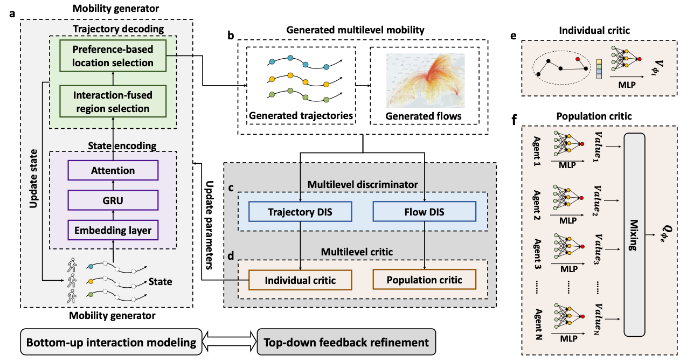

# DeepMobility

This is the official implementation of the manuscript **Learning the complexity of urban mobility with deep generative collaboration network**.

In this project, we introduce DeepMobility, a powerful deep generative collaboration network to bridge the
heterogeneous behaviors of individuals and collective behaviors emerging from the entire population. Our model excels in learning the intricate data distribution and successfully reproduces the existing universal
scaling laws that characterize human mobility behaviors at both the individual and population levels. It also exhibits
robust generalization capabilities, enabling it to generate realistic trajectories and flows for cities lacking corresponding training data. 

## Architecture of DeepMobility

## Installation

### Environment
- Tested OS: Linux
- Python >= 3.7
- PyTorch == 1.7.1

### Dependencies
1. Install [PyTorch](https://pytorch.org/get-started/previous-versions/) with the correct CUDA version.
2. Use the ``pip install -r requirements. txt`` command to install all of the Python modules and packages used in this project.

## Data

We use four datasets to demonstrate the DeepMobility generation framework.
The first two datasets (DS1, DS2) use the anonymized location record of about 1.8 million users in Beijing, China and 0.32 million users in Shenzhen, China, respectively. 
The third dataset (DS3) covering Shanghai (China) consists of around 1.9 million anonymized users of China’s major telecom company. 
The fourth dataset (DS4) of Senegal is based on anonymized call detail records (CDRs) from about 0.3 million users during a two-week period with a temporal resolution of 10 min. 
We provide the processed data of all four scenarios used in our paper, including [Beijing](DeepMobility/data/beijing/), [Shanghai](DeepMobility/data/shanghai/), [Shenzhen](DeepMobility/data/shenzhen/), 
and [Senegal](DeepMobility/data/Senegal/). 
For each case, we provide the following data:
* `data.json`: the individual trjaectories
* `loc2region.json`: the transformation from location index to region index
*  `region2loc.json`: the transformation from region index to location index
* `OD_6.npy`: dynamic origin-destination flows between regions, where the row index corresponds to the region index of the origin. It is aggregated by six hours, so there are four values for an origin-destination pair in a day
* `LocIndex2lonlat`: the transformation from location index to region longitude and latitude
* `RegionIndex2lonlat`: the transformation from Region index to region longitude and latitude
* `region_attribute.csv`: the attributes of the region, where the attribute name is recorded as the column name

## Model Training
For example, to train a model for the Shanghai city, run:

``
python main.py --cuda_id 0 --run_name 'test'  --dataset 'shanghai' --resolution 200 --lr 1e-4 --disc_lr 1e-4   --no_entropy_decay --actor_high_pretrain_epoch 200  --actor_low_pretrain_epoch 10 --uncertainty 2.0 --macro_coef 0.5  --with_evaluate --evaluate_batch 20000  --simulate_batch_size 128  --gail_batch_size 1024  --mode training
``

you can also include some parameters related to the model in [Parameters](https://github.com/tsinghua-fib-lab/DeepMobility/blob/main/ppo/arguments.py).

Once your model is trained, you will find the logs recording the training process in the  ``./tensorboard_log`` directory. The folder will be named as the start timne of the experiments. In the ``./ModelSave folder``, you will find the trained model named model_<epoch>.pkl and the generated synthetic data.

## Data Generation
For example, to generate the mobility data for the Shanghai city with a pre-trained model, run:

``
python main.py  --cuda_id 0 --run_name 'test'  --dataset 'shanghai' --resolution 200 --generate_num 20000 --pretrained_model model.pkl --simulate_batch_size 128
``

## Demo to run the code

We provide a demo to illustrate the training process of the model:

The generated mobility data is saved in ``./gen_data/``
